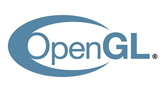
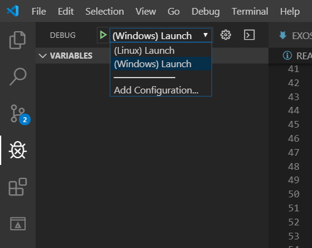

# OpenGL Tutorials

Tutorials made by IMAC students to learn, debug and use efficiently OpenGL.

## Table of Contents

+ [Getting started](#getting-started)
+ [Tutorials](#tutorials)
    - [Debug](#debug)
    - [Abstraction](#abstraction)

## Getting Started

### Prerequisites

You need to install [Cmake](https://cmake.org/) to build the project, and [RenderDoc](https://renderdoc.org/) if you want to follow the debugging exercices.

#### Linux

You will need a C++ compiler.

```bash
sudo apt-get install build-essential
```

You will also need the OpenGl and SDL2 packages.

```bash
sudo apt-get install libsdl2-dev
sudo apt-get install libglu1-mesa-dev mesa-common-dev
```

#### Windows

The recommended compiler is MSVC. To install it you will need [Visual Studio](https://visualstudio.microsoft.com/fr/) (which is not VSCode) and select the C++ development package during installation. The [MingW](http://www.mingw.org/) compiler will work as well if you prefer to use it.

### Build

You can handle the `CMakeLists.txt` in any way you like, here's some way to use it :

#### `Option 1: CLI`

```bash
mkdir build
cd build
cmake .. -DCMAKE_BUILD_TYPE=Debug
```

If you are on linux, you can then run `make` and launch the executable with `./build/bin/Debug/opengl-tutorial`.

If you are on windows, open the project with visual studio.

#### `Option 2: Visual Studio (Windows only)`

Open this folder with the `CMake...` option in file->open on Visual Studio, and run the project. Be sure to run the `CMakeLists.txt` project from the drop-down.


#### `Option 3: VSCode`

Use the `CMakeTools` plugin, build with `f7` then run with `f5` (But be carefull to be on the right platform, there is a launch file for windows and for linux).



## Tutorials

### Debug

Follow [this tutorial](doc/EXOS-DEBUG.md).

### Abstraction

Follow [this tutorial](doc/EXOS-CLASSES.md).
